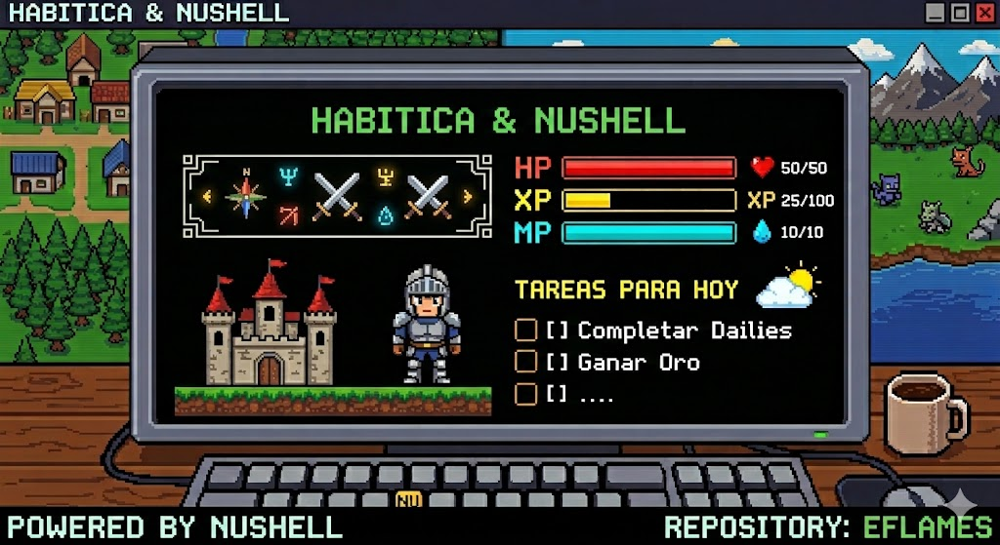
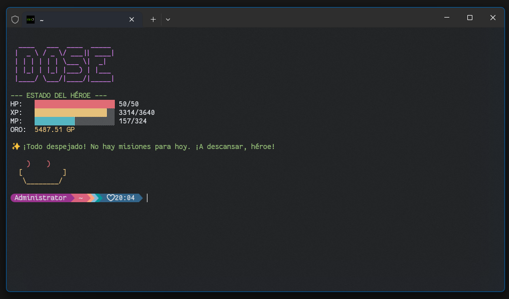

# ⚔️ Habitica & Nushell
Lleva tu productividad al siguiente nivel convirtiendo tu terminal en un centro de mando RPG. Este script permite sincronizar tus estadísticas de Habitica y gestionar tus tareas directamente desde Nushell, de forma rápida, estética y asíncrona.

# ✨ Características

- 📊 Dashboard de Estado: Visualiza tus barras de Vida (HP), Experiencia (XP) y Maná (MP) con colores ANSI dinámicos.
- 🚀 Actualización Asíncrona: Gracias a job spawn, los datos se descargan en segundo plano sin bloquear tu terminal.
- 📅 Filtro Inteligente: Muestra únicamente las tareas programadas para el día de hoy.
- ⚡ Ligero: Escrito 100% en Nushell puro, sin dependencias externas pesadas.

### ⚠️ DISCLAIMER: Yo uso Windows, esto fue desarrollado usando NUshell bajo el Windows Terminal (el ultimo que salio). Al ser NUshell --se supone-- que funcione en Linux o MacOS si tienes una terminal basada en NU.

# 🕹️ Comandos Disponibles

```TODO ADD "texto"```
Agrega una tarea a tus TO-DOs

```TODO LIST```
Muestra la lista de todas las TO-DOs pendientes

```TODO TODAY```
Muestra la lista de todas las TO-DOs pendientes con fecha de HOY

```TODO DONE + ID DEL TASK```
Finaliza la tarea con el ID especificado

```TODO WELCOME```
Muestra el "dashboard" con la informacion de tu personaje en Habitica, tareas para hoy y algun mensaje.

```TODO STATS```
Muestra tus barras de estado (HP, XP, MP) y oro actual de forma rápida.

```TODO SPELL LIST```
Muestra los hechizos disponibles según tu clase y tu maná actual.

```TODO SPELL USE [índice_hechizo] on [índice_tarea]```
Lanza un hechizo sobre una tarea específica. El 'on' es un separador estético. Usa los índices mostrados en `todo spell list` y `todo list`.

```TODO UPDATE```
Fuerza la actualización de tus estadísticas locales (cache) desde los servidores de Habitica.

# 📈 Futuro del proyecto
Esto lo hice en una tarde debido a que Habitica esta muy por detrás de otras herramientas para organizar tareas y hábitos, Todoist y Ticktick por ejemplo, tiene launchers en sus apps de escritorio que permiten agregar de forma muy rápida tareas. Como yo uso mucho el terminal, por qué no hacer que desde ahi agregue tareas y descargar el cerebreo de ideas.

Esto no quiere decir que no vaya a seguir creciendo, pienso ponerle mas y mas caracteristicas que me permitan poder manejar gran parte de las funciones de la plataforma desde el terminal, por ejemplo ponerle fecha a las tareas que agrego, soporte para dailies, etc... Tiempo al tiempo.

# 💡 Ideas hasta el momento

- Poder ponerle fecha a las tareas que agrego.
- Soporte para Dailies y Hábitos.
- Notificaciones de escritorio cuando una tarea está por vencer.



# ⚙️ Instalación

NOTA: Teniendo en cuenta que tu terminal ya corre NUshell o cualquiera que use NU

1. Crea una carpeta en tu PC y pega ahi el archivo habitica.nu
2. Escribe en tu terminal ```config nu``` y agrega esta linea ```use "C:/Direccion_de_tu_archivo/habitica.nu" *```
3. Abre el archivo habitica.nu y en las primeras lineas, agrega tu USER_ID y tu API_TOKEN de Habitica (no compartas este último)
4. Yo uso cache, para no tener que consultar tanto el API, en la variable CACHE_FILE, asignale una dirección donde quieres almacenar el archivo json de cache (preferiblemente al lado de habitica.nu)
5. Reinicia el terminar o cierralo y vuelve a abrirlo

### Todo lo que necesites editar, esta en ese archivo, eres libre de extenderlo si quieres.

Si quieres saber como instalar NUshell en Windows te dejo la documentacion oficial (es facil)
https://www.nushell.sh/book/default_shell.html

# 🤝 Contribuciones
¡Las sugerencias y pull requests son bienvenidos! Sientete libre de abrir un issue si encuentras algún error o tienes una idea para mejorar la "armadura" de este script.

Desarrollado con ❤️ por Ernesto Flames usando Nushell.
